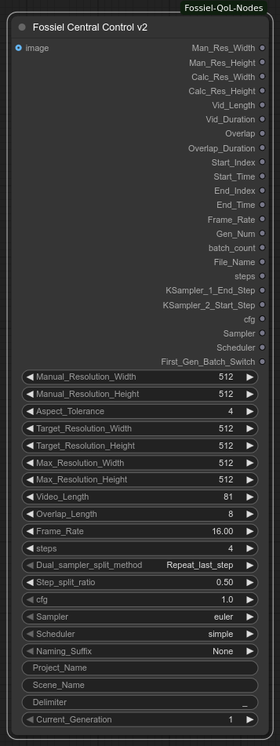

# ComfyUI-Fossiel-QoL-Nodes

ComfyUI-Fossiel-QoL-Nodes is (what will hopefully become) a suite of custom nodes for ComfyUI to improve quality of life. These nodes have been developed for personal use but maybe you’ll find them useful as well.

## Nodes

### FossielCentralControl_v2

This node is your go-to hub for managing settings in ComfyUI. It simplifies creating video clips in multiple consecutive runs (like extending a sequence) but it's versatile enough to work great for any ComfyUI project, keeping things organized and easy.

#### Specifications

**Inputs:**
1. **Images (optional)** – Accepts a single image or a batch of images. It grabs the batch size (how many images) and the resolution (width and height) of the first image. The batch size goes to the `batch_count` output, and the resolution is used to set the target dimensions for video or image generation, overriding the Resolution Target setting if connected.

**Parameters:**
1. **Resolution Settings** – Controls the size of your output image or video.  
   - *Manual Resolution*: Set your preferred width and height (e.g., 512x512). These go straight to the `Manual Resolution` output for use in other nodes.  
   - *Resolution Target*: Define the ideal width and height for your project (e.g., 512x512). If an image is connected to the Images input, its dimensions take over. The node calculates a final resolution that matches this aspect ratio as closely as possible, stays within a maximum pixel limit (set by Maximum Resolution), and aligns with a tolerance value for better AI compatibility. Lower tolerance values give a more accurate aspect ratio, while higher ones work better with the AI’s internal math.  
   - *Maximum Resolution*: Caps the width and height to keep the total pixels manageable. The calculated resolution is sent to the `Calculated Resolution` output.  
   - *Note*: If calculations go wonky (e.g., zero height), it defaults to 64x64 to keep things safe.  
2. **Video Settings** – Manages video-specific options for smooth generation.  
   - *Video Length*: Sets the number of frames (e.g., 81). It snaps to 1 or multiples of 4 + 1 (like 5, 9, 13) for compatibility and goes to the `Vid_Length` output.  
   - *Overlap Length*: Sets how many frames overlap between video segments (e.g., 8), sent to the `Overlap` output.  
   - *Frame Rate*: Defines frames per second (e.g., 16.0), sent to the `Frame_Rate` output.  
   - *Start/End Frames*: Based on Video Length and Current Generation (e.g., which clip you’re making, like clip 1 or 2), it calculates the first and last frame numbers, sent to `Start_Index` and `End_Index`. It also computes their timings (in seconds) for `Start_Time` and `End_Time`.  
   - *First Generation Switch*: Outputs a yes/no signal (1 for the first clip, 0 for others) to tweak setups for the first video clip differently, sent to `First_Gen_Batch_Switch`.  
3. **Sampling and Naming Settings** – Handles AI generation and file naming.  
   - *Sampling Steps*: Sets the number of AI processing steps (snaps to even numbers, e.g., 4). It splits these steps for two samplers in workflows, using a split method (repeat last step or move to next) and a ratio (e.g., 50/50). These go to `steps`, `KSampler_1_End_Step`, and `KSampler_2_Start_Step`.  
   - *CFG Scale*: Controls how closely the AI follows your prompt (e.g., 7.0), sent to the `cfg` output.  
   - *Sampler and Scheduler*: Chooses the AI’s processing style (e.g., “euler” sampler, “simple” scheduler), sent to `Sampler` and `Scheduler`.  
   - *File Naming*:  
     - **Project Name** – Base project identifier (e.g., `MyProject`).  
     - **Scene Name** – Specific scene or clip name (e.g., `Intro`).  
     - **Naming Suffix** – Choose `None` or `Current Gen` to append `Gen001`, `Gen002`, etc.  
     - **Delimiter** – Separator between parts (default `_`).  
     - The final name combines non-empty parts: `Project_Delimiter_Scene` or `Project_Delimiter_Gen001`, etc. Empty fields are skipped — no double delimiters. Output goes to `File_Name`, generation number to `Gen_Num`.  

**Outputs:**
1. **Manual Resolution** – The width and height you set in Resolution Settings, passed directly for use in other nodes (e.g., setting canvas size).  
2. **Calculated Resolution** – The final width and height calculated to match your target aspect ratio, stay within the pixel limit, and align with AI compatibility rules. Used for actual image or video generation.  
3. **Vid_Length** – The snapped number of video frames (e.g., 81).  
4. **Vid_Duration** – The video length in seconds (e.g., 81 frames at 16 FPS = 5.0625 seconds).  
5. **Overlap** – The number of overlapping frames between video segments.  
6. **Overlap_Duration** – The overlap time in seconds.  
7. **Start_Index** – The first frame number of the video sequence.  
8. **Start_Time** – The start time of the sequence in seconds.  
9. **End_Index** – The last frame number of the sequence.  
10. **End_Time** – The end time of the sequence in seconds.  
11. **Frame_Rate** – The frames per second for the video.  
12. **Gen_Num** – The current generation number (e.g., clip 1, 2).  
13. **batch_count** – The number of images in the input batch (0 if no image).  
14. **File_Name** – The final file name, with or without a generation suffix.  
15. **steps** – The total number of sampling steps (even).  
16. **KSampler_1_End_Step** – The steps for the first sampler in a dual-sampler setup.  
17. **KSampler_2_Start_Step** – The starting step for the second sampler.  
18. **cfg** – The guidance scale for the AI.  
19. **Sampler** – The chosen sampling algorithm.  
20. **Scheduler** – The chosen scheduler algorithm.  
21. **First_Gen_Batch_Switch** – A yes/no signal (1 or 0) for first-clip setup adjustments.

**Notes:**
- This node keeps all your settings in one place — resolution, video timing, sampling, and naming.
- The naming system is flexible: `Project_Scene`, `Project_Gen001`, or just `Scene` — no messy double underscores.
- Perfect for organizing multi-clip projects with clean, predictable filenames.

---

### Denoise Precision KSampler

This node is an exact clone of the ComfyUI core KSampler with only one difference -> The Denoise parameter is represented as a percentage instead of a fraction. This effectively adds 2 decimal places to the value and allows for extremely precise settings.  

---

### Image Level Matcher

On the surface, it's yet another brightness and contrast adjuster. However, this node allows you to match the brightness and contrast levels from a reference image, in addition to normal level settings. It was developed with the aim of adjusting greyscale images but it's equally as effective on color images. The levels can be fine tuned using the parameters.  

***Important:*** *When loading a batch of images, only the first frame will be used to match the levels in order to prevent flickering*  

#### Specifications

**Inputs:**
1. **image** – The image to be adjusted (required)  
2. **Brightness_Ref** – Reference image for brightness matching (optional)  
3. **Contrast_Ref** – Reference image for contrast matching (optional)  
4. **Saturation_Ref** – Reference image for saturation matching (optional)  

**Parameters:**  
1. **Match** – Choose what levels to match/adjust:  
   - `All` *(default)* – Match/Adjust all parameters  
   - `Brightness Only` – Match/Adjust only brightness  
   - `Contrast Only` – Match/Adjust only contrast  
   - `Saturation Only` – Match/Adjust only contrast  
   - `Brightness & Contrast` – Match/Adjust brightness & contrast  
   - `Brightness & Saturation` – Match/Adjust brightness & saturation  
   - `Contrast & Saturation` – Match/Adjust contrast & saturation  
2. **Brightness_offset** – Fine tune/Adjust brightness (-1.000–1.000).  
3. **Contrast_offset** – Fine tune/Adjust contrast (-1.000–1.000).  
4. **Saturation_offset** – Fine tune/Adjust saturation (-1.000–2.000).  
5. **Saturation_algorithm** – Choose what levels to match/adjust:  
   - `Global` – Will match based on the mean saturation level of the reference  
   - `Midtone-Weighted` *(default)* – Will match based on the highlight, midtone & shadow saturation levels of the reference  

**Outputs:**
1. **IMAGE** – Adjusted image  

---

### Resolution Wrangler

Resolution Wrangler is the ultimate VAE-compatible image sizer for ComfyUI. It automatically calculates the closest clean, non-fractional aspect ratio from your input image (or lets you set a manual ratio), crops the image perfectly to fill that aspect while preserving your chosen crop position, and then resizes the result to the largest size that maintains the **exact** aspect ratio, stays divisible by your selected VAE tolerance (8 or 16), and fits within your desired pixel budget.

The resulting image is **100% VAE compatible** at any size — no fractional scaling artifacts, no aspect drift, no wasted pixels.  

One of the many powerful use cases: if you're not blessed with a monster GPU and want to generate the largest possible 16:9 (or any other ratio) video or batch your hardware can comfortably handle, Resolution Wrangler will find the maximum clean resolution for you — every single time.

#### Specifications

**Parameters:**
1. **Aspect_method** – How to determine the target aspect ratio  
   - `Automatic` – Finds the closest clean integer ratio to the input image  
   - `Manual` – Use the user-defined Aspect_X : Aspect_Y ratio  
2. **Aspect_X** – Numerator of the manual aspect ratio (default: 4)  
3. **Aspect_Y** – Denominator of the manual aspect ratio (default: 3)  
4. **Crop_position** – Where to place the crop when expanding to fill the target aspect  
   - Options include: Center (default), Left and Top, Right and Bottom, X-Center and Top, etc.  
5. **Resize_by** – Controls how the target resolution / pixel budget is calculated  
   - `Max Resolution` (default) – Use the Max_Resolution_X × Max_Resolution_Y product as hard pixel cap  
   - `Ratio` – Scale from the cropped size by the Ratio percentage  
6. **Max_Resolution_X** – Maximum width allowed when Resize_by = Max Resolution (default: 1024)  
7. **Max_Resolution_Y** – Maximum height allowed when Resize_by = Max Resolution (default: 1024)  
8. **Ratio** – Percentage scaling factor from cropped size when Resize_by = Ratio (default: 100.0, min: 0.10, max: 10000.0)  
9. **Aspect_tolerance** – Output dimensions must be divisible by this value (8 or 16) – ensures perfect VAE compatibility  
10. **Resizing_method** – Interpolation method for final resize  
    - `lanczos` (default), `bicubic`, `bilinear`, `nearest-exact`

**Optional Inputs:**
- **image** – RGB image to process (required for normal operation)  
- **mask** – Optional mask (ComfyUI convention: 0 = keep/opaque, 1 = masked/transparent) – preserved through cropping & resizing

**Outputs:**
1. **Aspect_Image** – Cropped RGB image exactly matching the target aspect (before final resize)  
2. **Aspect_RGBA** – Same as Aspect_Image but with alpha channel (from input mask or fully opaque)  
3. **Aspect_Mask** – Cropped mask (if provided), ComfyUI convention  
4. **Resized_Image** – Final RGB image resized to largest VAE-compatible size under the pixel budget  
5. **Resized_RGBA** – Final resized image with alpha channel applied (inverted mask → alpha)  
6. **Resized_Mask** – Final resized mask (ComfyUI convention)  
7. **Aspect_X** – Simplified numerator of the final aspect ratio  
8. **Aspect_Y** – Simplified denominator of the final aspect ratio  
9. **Aspect_Image_X** – Width of the Aspect_Image  
10. **Aspect_Image_Y** – Height of the Aspect_Image  
11. **Resized_Image_X** – Final resized width  
12. **Resized_Image_Y** – Final resized height  

---

### Sensor Switches

This is a set of 8 switches with a very special ability: Besides being able to function like any other switch, these switches will detect which of their 2 input ports is active and send that to the output. This is particularly useful in workflows where group or node bypassing is present. Let's say, for example, you want to send either a generated or a loaded image to another node's input. You would then connect the VAE Decode node's output to the first input of the Sensor Switch Image node and a Load Image node to the second input. Whichever of the two is not bypassed, will be sent to the destination node. If both inputs are active, the True/False toggle becomes active and the switch works like any other switch.  

*IMPORTANT*: Due to ComfyUI's ability to allow data to pass through a bypassed node, the sensor nodes won't automatically switch when such a pass through situation occurs. To be safe, always switch to the desired input manually. Even with this limitation, these nodes will not error out if an input is not detected, which still makes the extremely useful.  

*Updated 2025/10/31*:  
The Sensor Switch Latent now also supports the latent format for WAN 2.1 & 2.2

---

### Qwen Size Stabilizer (No Longer in this pack. Moved it to ComfyUI-Fossiel-QwenHelpers)

If you've worked with Qwen Image Edit 2509 for any extended period of time, you will have probably experienced the unpredictability of the output when the resolution is set to a larger value than 1 megapixel (1024x1024). The Qwen Size Stabilizer node seeks to address this issue by allowing you to set an aspect ratio from a list of commonly used ones and the orientation of it. The resulting output is the exact chosen aspect ratio which is divisible by 2 and is as close as possible to the 1MP ceiling. Some aspects may exceed the 1MP threshold but by so little that the effect is neglegable.  

---

### Sequence Wrangler

This node allows you to load and manipulate image sequences, as though they were videos. You can manipulate the output batch to your liking or output single frames. It also supports image files with an alpha channel.  

***Important:*** *This node does not support animated image formats such as WebP and GIF. However, it does support static images in these formats.*  

#### Specifications

**Parameters:**
1. **Sequence_Dir** – Full path to the directory containing the sequence. (e.g., `C:\path\to\directory`).  
2. **Load Mode** – Choose how to extract frames:  
   - `All` – Load every frame  
   - `From first to Index 1` – Frames 0 to value of Index_1  
   - `From Index 1 to last` – Value of Index_1 to final frame  
   - `Index 1 to Index 2` – Between two indices  
   - `First frame` – Only frame 0  
   - `Last frame` – Final frame  
   - `Index 1 frame` – Single frame at value of Index_1  
   (Important: For all batch modes, the range includes the indexed frame(s). E.g. In `From first to Index 1` mode, with an index value of 3, a batch count of 4 will be output.)  
3. **Missing_Alpha_Handling** – Choose how to handle images without an alpha channel:  
   - `Opaque` – Will output a solid white mask frame  
   - `Transparent` – Will output a solid black mask frame  
4. **Index 1** – First index for range-based modes (0-based).  
5. **Index 2** – Second index for `Index 1 to Index 2` mode. (Ignored for all other modes)  

**Outputs:**
1. **images** – Batch of RGB frames as `IMAGE` tensor (float32, 0–1).  
2. **Alpha as mask** – Alpha channel as grayscale mask (1.0 = opaque). Solid alpha (all 0 or 1) is normalized to 1.0.  
3. **total_batch_count** – Total number of frames in the sequence.  
4. **split_batch_count** – Number of frames actually loaded.  

---

### WebP Wrangler

This node allows you to load and use animated WebP files, as though they were proper videos. You can manipulate the animated batch to your liking or output single frames. It also supports WebP files with an alpha channel.

#### Specifications

**Inputs:**
1. **WebP Path** – Full path to the animated WebP file (e.g., `C:/animation.webp`).  
2. **Load Mode** – Choose how to extract frames:  
   - `All` – Load every frame  
   - `From first to Index 1` – Frames 0 to value of Index_1  
   - `From Index 1 to last` – Value of Index_1 to final frame  
   - `Index 1 to Index 2` – Between two indices  
   - `First frame` – Only frame 0  
   - `Last frame` – Final frame  
   - `Index 1 frame` – Single frame at value of Index_1  
   (Important: For all batch modes, the range includes the indexed frame(s). E.g. In `From first to Index 1` mode, with an index value of 3, a batch count of 4 will be output.)  
3. **Index 1** – First index for range-based modes (0-based).  
4. **Index 2** – Second index for `Index 1 to Index 2` mode. (Ignored for all other modes)

**Outputs:**
1. **images** – Batch of RGB frames as `IMAGE` tensor (float32, 0–1).  
2. **Alpha as mask** – Alpha channel as grayscale mask (1.0 = opaque). Solid alpha (all 0 or 1) is normalized to 1.0.  
3. **total_batch_count** – Total number of frames in the WebP file.  
4. **split_batch_count** – Number of frames actually loaded.  
5. **Frame Rate** – Approximate FPS (rounded due to limitations of the webp library), or 10.0 if undetected.

**Notes:**
- Supports **animated WebP** with alpha transparency.
- Single-frame WebP returns a batch of 1.
- Errors (invalid path, corrupted file) raise clear messages.
- Frame rate is calculated from animation timestamps.

---
---

### Installation Instructions
1. Clone or download this repository to your local machine.
2. Copy the repository folder to your ComfyUI custom nodes directory: `ComfyUI/custom_nodes/`
3. Install dependencies by running:
    pip install -r ComfyUI/custom_nodes/ComfyUI-Fossiel-QoL-Nodes/requirements.txt
4. Restart ComfyUI to load the Fossiel Quality of Life nodes.
5. Find the nodes in ComfyUI under the category Fossiel/QoL.

---

## History
2026/02/14 - Added Resolution Wrangler
2026/02/07 - Added Denoise Precision KSampler node  
2026/02/07 - Added Video De-flicker node  
2026/02/07 - Fixed a bug in Sensor Switch Latent and Sensor Switch KSampler that prevented inpainted latents from being passed correctly.  
2026/02/07 - Renamed Image Level Matchmaker to Image Level Matcher  
2026/02/07 - Adjusted setting tolerances from 0.01 to 0.001 in Image Level Matchmaker  
2026/02/07 - Moved Qwen Size Stabilizer to ComfyUI-Fossiel-QwenHelpers.  
2025/12/28 - Updated Image Level Matchmaker.  
2025/12/23 - Added Image Level Matchmaker  
2025/12/10 - Fixed the loading bug in Sequence Wrangler.  
2025/11/29 - Added Sequence Wrangler for loading and manipulation of image sequences.  
2025/11/17 - Added Qwen Size Stabilizer for predictable Qwen generations.  
2025/10/31 - Updated the Sensor KSampler Switch to have switching support for all KSampler and KSampler (Advanced) input ports.  
2025/10/31 - Added WAN 2.1 & 2.2 support to the Sensor Switch Latent node.  
2025/10/28 - Added WebP Wrangler for animated WebP loading with frame range control.  
2025/10/28 - Updated FossielCentralControl_v2: Added Project_Name, renamed Name → Scene_Name, improved naming logic (no double delimiters).  
2025/10/27 - Added Sensor Switch Nodes.  
2025/10/26 – Launched with Fossiel Central Control node.  

---

## Credits  
Developed with help from Grok3  
All the developers who make tools available to everyone using local AI  
Model developers for supplying fantastic open source models, free of charge.  

